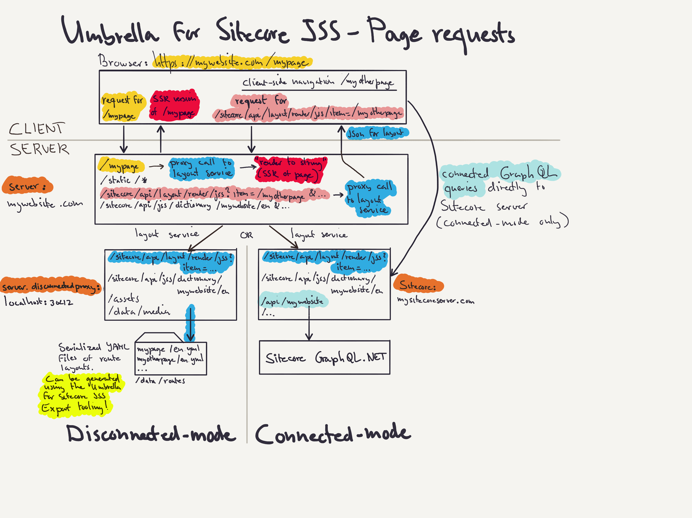
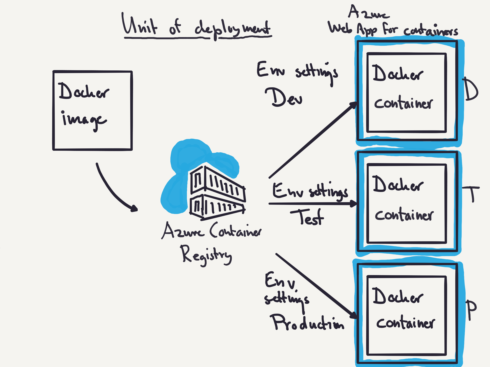

# Umbrella for Sitecore JSS


            __.|.__ 
        .n887.d8'qb'""-.
      .d88' .888  q8b. '. 
     d8P'  .8888   .88b. \
    d88_._ d8888_.._9888 _\
      '   '    |    '   '____  ____  ___      ___  _______    _______    _______  ___      ___            __
               |        (""  _||_ ""||"" \    /"" ||   _  ""\/""     \  /""    ""||""|    |"" |         /""""\
               |        |   (  ) : | \   \  //   |(. |_)  :)|:        |(: ______)||  |    ||  |         /    \
               |        (:  |  | . ) /\\  \/.    ||:     \/ |_____/   ) \/    |  |:  |    |:  |        /' /\  \
               |         \\ \__/ // |: \.        |(|  _  \\  //      /  // ___)_  \  |___  \  |___    //  __'  \
               |         /\\ __ //\ |.  \    /:  ||: |_)  :)|:  __   \ (:     ""|( \_|:  \( \_|:  \  /   /  \\  \
             '='        (__________)|___|\__/|___|(_______/ |__|  \___) \_______) \_______)\_______)(___/    \___)
  


| Branch | Build status | Disconnected example url |
| --- | --- | --- |
| develop | [](https://dev.azure.com/MacawInteractive/react-jss-typescript-starter/_build/latest?definitionId=1&branchName=develop) | https://react-jss-typescript-starter-develop.azurewebsites.net (latest)|
| master | [](https://dev.azure.com/MacawInteractive/react-jss-typescript-starter/_build/latest?definitionId=1&branchName=master) | https://react-jss-typescript-starter.azurewebsites.net (behind on develop)|

Welcome to the [Umbrella for Sitecore JSS](https://github.com/macaw-interactive/react-jss-typescript-starter) starter template. **Umbrella for Sitecore JSS** is our vision on how a website should be developed and hosted while using Sitecore as a headless CMS.

## The default branch
Currently the default branch is the `develop` branch because the project is in full development. When we reach a more stable situation we will merge the `develop` branch into the `master`. At that moment the `master` branch will become the default branch.

## Introduction
With the introduction of [Sitecore JavaScript Services](https://jss.sitecore.com/), or JSS for short, Sitecore created an SDK to allow developers to use Sitecore as a headless CMS. Finally website developers are free to build a website using their own technology stack while utilizing the Sitecore platform.

**Umbrella for Sitecore JSS** is our vision on how a website should be developed and hosted while using the JSS SDK and Sitecore as a headless CMS.

## Quick Start
If you have [Node](https://nodejs.org) installed you can get started in four commands, even without having Sitecore running on your machine:

```
npm install -g @sitecore-jss/sitecore-jss-cli
jss create --repository macaw-interactive/react-jss-typescript-starter --branch develop my-first-jss-app react-typescript
cd my-first-jss-app
jss start
```

And now get wild using the following most important commands:

| Command | Runs on | What is does |
| --- | --- | --- |
| `npm run jss config` | N.A. | configure your project - also some settings in the package.json that need to be changed |
| `npm run start:disconnected` | http://localhost:3000 | Client side only development, disconnected from sitecore |
| `npm run start:connected` | http://localhost:3000 | Client side only development, connected to sitecore |
| `npm run start:storybook` | http://localhost:9001 | Use storybook for out-of-context component development |
| `npm run serve:disconnected ` | http://localhost:3000 (client-side rendering) and http://localhost:3001 (server-side rendering) | Both client side and server side rendering, disconnected from sitecore |
| `npm run serve:connected ` | http://localhost:3000 (client-side rendering) and http://localhost:3001 (server-side rendering) | Both client side and server side rendering, connected to sitecore |
| `npm run docker:build` | N.A. | Build a local Docker image |
| `npm run docker:run:disconnected` | http://localhost:8888 | run the local Docker image disconnected from Sitecore |
| `npm run docker:run:connected` | http://localhost:8888 | run the local Docker image connected to Sitecore |
| `npm run docker:shell` | N.A. | show the command to execute a shell on the running Docker container |

## Table of Contents
- [Umbrella for Sitecore JSS](#umbrella-for-sitecore-jss)
  - [The default branch](#the-default-branch)
  - [Introduction](#introduction)
  - [Quick Start](#quick-start)
  - [Table of Contents](#table-of-contents)
  - [The react-jss-typescript-starter starter kit](#the-react-jss-typescript-starter-starter-kit)
    - [Umbrella for Sitecore JSS - What happens on page requests](#umbrella-for-sitecore-jss---what-happens-on-page-requests)
  - [Why did we build this starter kit?](#why-did-we-build-this-starter-kit)
  - [Getting connected to Sitecore](#getting-connected-to-sitecore)
  - [Development with server-side rendering](#development-with-server-side-rendering)
  - [Configuring the NodeJS Express web server](#configuring-the-nodejs-express-web-server)
  - [Development scripts](#development-scripts)
    - [Daily development](#daily-development)
    - [Check if app is working with server-side rendering](#check-if-app-is-working-with-server-side-rendering)
    - [Build the artifacts for deployment to Sitecore](#build-the-artifacts-for-deployment-to-sitecore)
    - [Build web server application](#build-web-server-application)
  - [Scaffolding new JSS components](#scaffolding-new-jss-components)
  - [Umbrella Sync tool](#umbrella-sync-tool)
  - [Ports](#ports)
    - [Ports in use](#ports-in-use)
  - [Debugging](#debugging)
    - [Debugging the client-side code](#debugging-the-client-side-code)
    - [Debugging the server-side rendering](#debugging-the-server-side-rendering)
    - [Debugging the Sitecore disconnected mode proxy](#debugging-the-sitecore-disconnected-mode-proxy)
    - [Debugging the webback server bundle build](#debugging-the-webback-server-bundle-build)
    - [Debugging docker build & run scripts](#debugging-docker-build--run-scripts)
  - [Docker](#docker)
    - [Docker image as unit of deployment](#docker-image-as-unit-of-deployment)
  - [Deployment the solution as a Docker container on Azure](#deployment-the-solution-as-a-docker-container-on-azure)
  - [The Azure pipeline Yaml file](#the-azure-pipeline-yaml-file)
  - [Configure the Azure build pipeline](#configure-the-azure-build-pipeline)
  - [Deploy image to Azure Web Apps for Containers](#deploy-image-to-azure-web-apps-for-containers)
  - [Writing documentation](#writing-documentation)
  - [FAQ](#faq)
    - [Page not found when starting development in disconnected mode](#page-not-found-when-starting-development-in-disconnected-mode)
    - [Why do `npm run serve:disconnected` and `npm run serve:connected` start the client-side rendering?](#why-do-npm-run-servedisconnected-and-npm-run-serveconnected-start-the-client-side-rendering)
    - [What is the role of the `src/HMR.ts` file?](#what-is-the-role-of-the-srchmrts-file)
    - [Why is there no automatic reload for SSR?](#why-is-there-no-automatic-reload-for-ssr)
  - [References](#references)
- [Authors](#authors)

## The react-jss-typescript-starter starter kit

At Macaw Interactive we made choices with respect to the front-end development technology stack that we use, and the way we build web applications. Our primary front-end technology stack consists of:

- ReactJS (using Redux where applicable)
- TypeScript
- GraphQL
- Server-side rendering for SEO

For more information on the Macaw Interactive thoughts on technology complemented with an assessment result see the [Macaw Interactive front-end Technology Radar](https://github.com/macaw-interactive/radar).

The [react-jss-typescript-starter](https://github.com/macaw-interactive/react-jss-typescript-starter) is our starter project implementing our **Umbrella for Sitecore JSS** vision and tooling: a headless Sitecore 9.1.x JSS web application supporting server-side rendering and running outside of the Sitecore Content Delivery server. It provides a NodeJS Express based web site with all the required configuration options to run in a Docker container. This starter is based on the Sitecore provided sample [node-headless-ssr-proxy](https://github.com/Sitecore/jss/tree/dev/samples/node-headless-ssr-proxy) combined with the starter project as scaffolded using the Sitecore JSS CLI with the command `jss create react-jss-typescript-starter react`. The code of the scaffolded site is completely converted to TypeScript and a lot of additional features are added to the toolset.

### Umbrella for Sitecore JSS - What happens on page requests


Provided features:

- supports the (well documented) JSS standard development flow, but with many enhancements
- JSS component scaffolding using [Plop](https://plopjs.com/), a powerfull scaffolding tool
- data/routes Sitecore Yaml import/export using the [Umbrella](https://github.com/macaw-interactive/umbrella-for-sitecore-jss) tool
- code structure with separation of JSS components (as container components) and presentational components (see [Presentational and Container Components](https://medium.com/@dan_abramov/smart-and-dumb-components-7ca2f9a7c7d0))
- [Storybook](https://storybook.js.org/) for presentational components
- build tasks extended to build a headless NodeJS Express based web server with support for server-side rendering
- the web server is using `sitecore-jss-proxy` that enables request proxying to a Sitecore CD along with the http cookies to enable tracking, personalization, contact identification and multivariate testing
- Dockerfile to build a Docker image for running the NodeJS Express based front-end web server
- Docker container completely configurable using environment variables
- extensive documentation

## Why did we build this starter kit?
This is our way of giving back to the community, and a great way to show our customers and potential new employees our vision on Sitecore development.

## Getting connected to Sitecore
Rename the file `sitecore/config/react-jss-typescript-starter.config` to `my-first-jss-app.config` and make the required changes as described [here](https://jss.sitecore.com/docs/getting-started/app-deployment#step-1-configure-your-apps-site-and-host-name):

- In the file `sitecore/config/my-first-jss-app.config`Replace all occurences of `react-jss-typescript-starter` with `my-first-jss-app`
- In the file `package.json`:
  - replace all occurences of `react-jss-typescript-starter` with `my-first-jss-app`
  - modify the `description` and `url` paths to suit your needs

The first command to execute next is `jss setup` (or `npm run jss setup` if jss cli is not installed globally) to create the `scjssconfig.json` file. This file is user-specific and is ignored from source-control. The file will look something like:

```json
{
  "sitecore": {
    "instancePath": "c:\\inetpub\\wwwroot\\sc910.sc",
    "apiKey": "{57231674-4CC9-48AA-AFF0-190DB9D68FE1}",
    "deploySecret": "yourdeploymentsecretmagicnumber",
    "deployUrl": "http://my-first-jss-app.dev.local/sitecore/api/jss/import",
    "layoutServiceHost": "http://my-first-jss-app.dev.local"
  }
}
```

Based on the `scjssconfig.json` the development npm scripts create the files `.env.connected` and `.env.disconnected` when needed. These files contain the environment variables with all configuration information. Note that these files are excluded from source control as well (see the `.gitignore` file). 

## Development with server-side rendering

When doing development using `npm run start` (for disconnected development) or `npm run start:connected` (connected to Sitecore) all React rendering is executed client side. If you do a view-source you will see the contents of the `public/index.html` file.

It is often a good idea to do development with server-side rendering enabled to check if the code does not use constructs that do not work server-side. A good example of such a construct is accessing browser specific objects like `window`.

The out-of-the-box approach for running with server-side rendering can be achieved by deploying the app to Sitecore (`jss deploy app`) and open the site on the url [binding](https://jss.sitecore.com/docs/getting-started/app-deployment#step-1-configure-your-apps-site-and-host-name) as created for the app in Internet Information Server. 

The above command deploys the build artifacts in the folder `build` from your app to the `sitecoreDistPath` (set in your app's `package.json`) under the proxy root path, where the proxy root is the root folder of the website your binding is configured on. Most apps use `/dist/${jssAppName}`, for example `$proxyRoot/dist/${jssAppName}`. Another way to deploy the artifacts to the proxy is to change the `instancePath` in your app's `scjssconfig.json` to the proxy root path, and then use `jss deploy files` within the app to complete the deployment to the proxy.

The above deployment process is slow and requires a Sitecore server to deploy to. 

There is also another approach that can be started with the command `npm run serve:connected`. The app is now served using a NodeJS Express based web server in development mode with the following features:

- provides server-side rendering without creating a production build and costly deployments to Sitecore first
- JavaScript bundle required for running the web server (including all code for the React components) is rebuilt on each code change
- the NodeJS Express web server is restarted on each rebuild of the server bundle (uses `nodemon`)
- the development build bundle contains sourcemaps for easy debugging of the server-side code
- the server-side rendering of the code can be debugged directly from Visual Studio Code
- the server-side rendering can also be done in disconnected mode using `npm run serve:disconnected`

The NodeJS Express web server can be configured through [environment variables](#node_config) as described below.
In `npm run serve:disconnected` (or the shorthand `npm run serve`) and `npm run serve:connected` we use `nodemon` which watches for code changes. Nodemon is configured through the `server/nodemon.json` configuration file.

## Configuring the NodeJS Express web server

The NodeJS Express web server is completely configured through environment variables. This enables running the web server in a Docker container, where the running image for dev, test, acceptation and production can be configured through environment variables (or App Settings in case of a deployment to Azure Web Apps for Containers).

The environment variables can be used in NodeJS server code using `process.env.<EnvVariableName>`. Many of the variables are made available at runtime for the client-side code as properties on the global variable `window.app` as `window.app.<name>`.

| Env variable | window.app property | Description |
| --- | --- | --- |
| `NODE_ENV` | N.A. | Either `development` or `production` |
| `REACT_APP_NAME` | `window.app.appName` | Name of the app, in development generation same as `REACT_APP_SITECORE_JSS_APP_NAME` |
| `REACT_APP_APPINSIGHTS_KEY` | `window.app.instrumentationKey` | Azure Applications Insights key |
| `REACT_APP_BUILDVERSION` | `window.app.buildVersion` | Build version, in development generation set to `DevBuild` |
| `REACT_APP_ENVIRONMENT` | `window.app.environment` | Current environment, in development set to `Development` |
| `REACT_APP_ENVIRONMENTCONNECTIONS` | `window.app.environmentConnections` | Summary of environment connections, in development set to `ScDisconnected` in disconnected mode, and to `ScConnected` in connected mode |
| `REACT_APP_ADDITIONALSETTINGS` | `window.app.<setting>` | Additional application settings, in development set to `,ignore:0` to make `index.html` valid |
| `REACT_APP_SITECORE_JSS_APP_NAME` | `window.app.sitecoreJssAppName` | Sitecore app name |
| `REACT_APP_SITECORE_API_KEY` | `window.app.sitecoreApiKey` | The Sitecore SSC API key your app uses |
| `REACT_APP_SITECORE_API_HOST` | `window.app.sitecoreApiHost` | Sitecore instance host name (should be HTTPS in production) when connected, http://localhost:3042 is disconnected |
| `REACT_APP_SITECORE_DEFAULT_LANGUAGE` | `window.app.sitecoreDefaultLanguage` | Default language to use |
| `SITECORE_ENABLE_DEBUG` | `window.app.sitecoreEnableDebug` | Writes verbose request info to stdout for debugging. Defaults to `false` |
| `REACT_APP_SITECORE_CONNECTED` | `window.app.sitecoreConnected` | Optional. If `true` run disconnected from Sitecore in a production environment. Only used if `NODE_ENV === 'production'` |
| `REACT_APP_SITECORE_PATH_REWRITE_EXCLUDE_ROUTES` | N.A. | Optional. Pipe-separated list of absolute paths that should not be rendered through SSR. Defaults can be seen in the file `server/config.ts` |

In development we mostly use the following npm commands:

- `npm run start:disconnected` (shorthand `npm start`)
- `npm run start:connected`
- `npm run serve:disconnected` (shorthand `npm run serve`)
- `npm run serve:connected` 

These commands autogenerate the required environment variable configuration files `.env.disconnected` and `.env.connected`. The values of the environment variables are based on the values as defined in the `scjssconfig.json` file. The `scjssconfig.json` configuration file is generated by the command `jss setup`. 

In the production build the file `.env.production` is used that defines all environment variables as `VARNAME=##VARNAME##`. The resulting `##VARNAME##` values could be replaced during the production build in for example the Azure DevOps build pipeline. All `##VARNAME##` values remaining in `build/index.html` are replaced on runtime when serving the `build/index.html` file from the NodeJS Express web server. The replacement values are based on the configured enviroment variables. This is mandatory in the case of a Docker image based deployment, because we want to have the Docker image as the single source of deployment to different environments and don't want to change the contents of the Docker image.

## Development scripts

There are many development scripts that can be found in `package.json`. The most important development scripts are described below.

### Daily development

Default JSS based development workflow:

Disconnected: `npm run start:disconnected` or its short-hand `npm start`

Connected: `npm run start:connected`

All other default JSS based scripts are available as well.

### Check if app is working with server-side rendering

Run the NodeJS Express based web server with server side rendering in development mode:

Disconnected: `npm run serve:disconnected` or its short-hand `npm run serve`

Connected: `npm run serve:connected`

### Build the artifacts for deployment to Sitecore

Build web server and production mode server bundle for deployment to Sitecore: `npm run build`

The resulting code can be deployed to Sitecore using the command `jss deploy app` as described in the [documentation](https://jss.sitecore.com/docs/getting-started/app-deployment).

### Build web server application

Build the NodeJS Express web server application supporting server-side rendering:

- For development: `npm run build-server:development` (contains source-map)
- For production: `npm run build-server:production` (minified)

Execute the NodeJS Express based web server application from the root folder using `node build.server/index.js`. The `build.server/index.js` script contains all required code. The server bundle with all components is embedded. The web server runs in connected mode if the environment variable `REACT_APP_SITECORE_CONNECTED` is set to `true`, otherwise it runs in disconnected mode.

## Scaffolding new JSS components

[Plop](https://plopjs.com/) is used for scaffolding new components, instead of the original `scripts/scaffold-component.js` script that was provided by Sitecore out of the box in the React starter. Currently the only scaffolding available is for JSS class component and JSS function component using the following command:

```
npm run plop
```

This command asks for the type of JSS component to create, a component name (i.e. MyComponent) and generates the following files:

- `src\jsscomponents\MyComponent\index.tsx`
- `src\jsscomponents\MyComponent\MyComponent.props.ts`
- `sitecore\definitions\components\MyComponent.sitecore.ts`

Currently the following JSS component types are supported:
- A JSS Class Component with props and state
- A JSS Function Component

## Umbrella Sync tool

In Sitecore JSS you normally can choose between two developer workflows: [`Code First`](https://jss.sitecore.com/docs/fundamentals/dev-workflows/code-first) and [`Sitecore First`](https://jss.sitecore.com/docs/fundamentals/dev-workflows/sitecore-first). With the `Code First` approach the ownership of items are with the front-end developer and part of the code. These items can be published to Sitecore. All items and artifacts must be maintained manually by the developer in Yaml files. Using this workflow it is possible to develop completely disconnected from Sitecore. With `Sitecore First` items are maintained within Sitecore, and accessed through the layout-service provided by Sitecore. The `Sitecore First` workflow is in the end the way to go, but you can get an end along the way using the `Sitecore First` approach. To help you even further along the way there is the [Umbrella.PanTau project](https://github.com/macaw-interactive/umbrella-for-sitecore-jss) which adds an extra JSS endpoint `/sitecore/api/layout/render/umbrella` to your environment. This endpoint can be used to extract data from your Sitecore JSS environment to Yaml files and atifascts so they can become part of your code-base.

## Ports

When doing development the following ports are used:

- http://localhost:3000: client-side rendered web-site using the create react app development server
- http://localhost:3001: the server-side rendered web-site servered by the NodeJS Express based web server
- http://localhost:3042: the disconnected mode Sitecore proxy
- http://localhost:8888: The Docker container running the web-site (`npm run docker:run`)
- http://localhost:9001: Storybook for out-of-context component development 

### Ports in use

Sometimes when doing development and stopping a running process a port remains still in use. I have this sometimes
when developing disconnected where a dummy layout service is running on port 3042. If this happens to you, you can
kill the process using the (Windows only) command:

`scripts/kill-ip.bat 3042`

# Enable GraphQL Typescript generation

To generate the graphql typescript types and queries from your schema, configure the codegen.yml and run:
```
npm run typescript:generate
```
You will have an generated file at this location: src\models\Types.ts
More info [here](https://graphql-code-generator.com)

## Debugging

One of the most important things in development is the ability to debug your code in a good way. This starter provides all the required configurations for Visual Studio Code to do debugging to the max!

### Debugging the client-side code

Although debugging if provided in Chrome through the developer tools, it is also possible to do client-side code debugging in Visual Studio Code. To do this install the `Debugger for Chrome` extension first.

To start client-side debugging start the `Client [3000]` debug configuration.


### Debugging the server-side rendering

One of the important features provided by this starter template is the ability to debug the server-side rendering code in both connected AND disconnected mode without the need to deploy to Sitecore first. The ability to debug the server-side rendering is really useful because code running perfectly fine on the client-side can completely break when executed server-side. The simplest example is accessing the `window` object, which exists during client-side rendering, but not during server-side rendering.

To debug execute the following commands:

- connected mode: `npx env-cmd .env.connected npm run start:react`
- disconnected mode: `npx env-cmd .env.disconnected npm run start:react`

The web server can then be started using the provided debug configurations `Server:disconnected [3001]` and `Server:connected [3001]`. 

### Debugging the Sitecore disconnected mode proxy

In development the script `scripts/disconnected-mode-dev-proxy.js` provides the Sitecore disconnected mode proxy. This script can be debugged in Visual Studio Code by executing the `SC disconnected [3042]` debug configuration.

### Debugging the webback server bundle build

The webpack server-bundle build can be debugged in Visual Studio Code by executing the `server.bundle Webpack` debug configuration.

### Debugging docker build & run scripts

The script `scripts/docker-do.js` can be used to build and run the docker image. This script can be debugged in Visual Studio Code by executing the `docker-do build` and `docker-do run` debug configurations.

## Docker

The starter kit contains scripts to build and run a Docker image containing the complete solution. This Docker image can be run locally or be deployed to a Docker container registry.

The `Dockerfile` used to build the Docker image can be found at `Docker/Dockerfile`. The
Dockerfile is a multi-stage Dockerfile that builds the production version of the solution and
creates an image containing the solution.

The resulting Docker image has the following features:

- uses [Nginx](https://www.nginx.com/) as a reverse proxy (config file: `Docker/nginx.config)
- uses [PM2](http://pm2.keymetrics.io/) as a process manager to utilize all available cores and restart on crashing (config file: `Docker/process.yml`)
- contains an SSH server that connects to the web-based SSH client of Azure App Services when deployed on an Azure Web App for Containers

The script `Docker/init.sh` is executed when the Docker container starts running.

The configuration files in the `Docker` folder are used on a Linux system and must contains LF. These files could be in DOS format containing CRLF and must be converted to unix format. This is automatically done when the Docker image is built.

| Command | Runs on | What is does |
| --- | --- | --- |
| `npm run docker:build` | N.A. | Build a local Docker image |
| `npm run docker:run:disconnected` | http://localhost:8888 | run the local Docker image disconnected from Sitecore |
| `npm run docker:run:connected` | http://localhost:8888 | run the local Docker image connected to Sitecore |
| `npm run docker:shell` | N.A. | show the command to execute a shell on the running Docker container |

For more configuration like port number and debug mode call the script directly:

`node scripts/docker-do.js run [--port <portnumber>] [--disconnected] [--debug]`

The `docker:run` command does the following things:

- kill a running previous container if needed
- expose the Sitecore layout service host as defined in `scjssconfig.json` through [Ngrok](https://ngrok.com/) because an IIS hosted website with hostname binding on port 80 is not visible from a locally running Docker container
- start the NodeJS Express based web server with server-side rendering on http://localhost:8888
- run disconnected from Sitecore when `--disconnected` is specified. In this case the `data` folder is used

All output of the running container is provided in the terminal window. Note that if you do CTRL-C the output stops, but the container keeps running in the background. Execute `docker ps` to see the executing Docker container. To kill the running Docker container execute `docker kill <id>`.

The Docker image is completely configurable through environment variables. This means that the same image can be used for every environment (local, development, test, acceptation, production).

### Docker image as unit of deployment
In our vision the Docker image is the unit of deployment, configured per environment through environment variables.




## Deployment the solution as a Docker container on Azure

Any change on the `develop` and `master` branches of the https://github.com/macaw-interactive/react-jss-typescript-starter repository are automatically built and deployed as a Linux Docker container running on an Azure Web App for Containers:

| Branch | Deployed to |
| --- | --- |
| develop | https://react-jss-typescript-starter-develop.azurewebsites.net |
| master | https://react-jss-typescript-starter.azurewebsites.net |

The resulting web site is configured in disconnected mode, so no Sitecore server or license is required to run the web site.

## The Azure pipeline Yaml file

The following `azure-pipeline.yml` file drives the build of the Docker image and the deployment of the image to the Azure container registry:

```yaml
trigger:
  branches:
    include:
    - master
    - develop

pool:
  vmImage: 'Ubuntu-16.04'

steps:
- checkout: self
  submodules: true
  
- script: |
    docker build -f Docker/Dockerfile -t $(dockerId).azurecr.io/$(imageName) .
    docker login -u $(dockerId) -p $(dockerPassword) $(dockerId).azurecr.io
    docker push $(dockerId).azurecr.io/$(imageName)
  displayName: 'docker build'
```

This Azure pipeline configuration file uses the following environment variables:

| Variable | Purpose | Example |
| --- | --- | --- |
| imageName | The name to tag the Docker image with | For example `react-jss-typescript-starter` |
| dockerId | The name of the Azure container registry | For example `jssumbrella` (without `azurecr.io`) |
| dockerPassword | The password to log in the Azure container registry | See your Azure container registry under *Access keys* |

## Configure the Azure build pipeline

The starter is hosted in a Git repository on Github. Github is bought by Microsoft, and now Github provides integration with Azure and its pipelines for build and deploy. This integration can be enabled through the [Azure Pipelines app](https://github.com/marketplace/azure-pipelines) at the Github marketplace.

After setting up and configuring the Azure Pipelines app for your Github account move over to https://dev.azure.com. In the new configured Azure DevOps organization you can setup new projects. See the [documentation](https://docs.microsoft.com/en-us/azure/devops/pipelines/?view=azure-devops) for more details.

Within the project execute the following steps:

1. select `Pipelines` and create a new build pipeline
   
2. select the location of the code repository, in our case GitHub
   
3. select the repository to use
4. the `azure-pipeline.yml` file will be automatically picked up
5. select `Run` to save it (why? - why can't I specify a name?) - cancel the build, we need to set variables!!
6. select the pipelines, select the new created pipeline, select the dots menu to access the menu and rename the pipeline
   
7. select the new created pipeline, select `Edit`, select the dots menu to reach the variable definition screen
8. configure the above described variables
9. run the build

The build will result in a Docker image pushed to the specified Azure container registry with either the tag `$(imageName):develop` or `$(imageName):master`.

## Deploy image to Azure Web Apps for Containers
Deploy image from the Azure container registry to an zure Web App for Containers as described in the article https://docs.microsoft.com/en-us/azure/app-service/containers/tutorial-custom-docker-image. 

## Writing documentation
Within the website published from this repository we load the `/samples/react-typescript/README.md` file as available in the `develop` branch. This is in general the latest version of the documentation. The raw version of this file is requested through a service called jsDeliver. This service makes it possible to read a raw file from GitHub with the correct mime-type `text/markdown`. The raw version of the file is cached on a CDN. This cached version can be purged with the command `npm run purge:readme`. 

## FAQ

### Page not found when starting development in disconnected mode
Most of the time when you start the client-side rendering using `npm run start:disconnected` (or the shorthand `npm start`) or server-side rendering using `npm run serve:disconnected` (or the short hand `npm run serve`) you will get the following error on the automatically started browser on the url http://localhost:3000:

```
Page not found
This page does not exist.

Site: 
Language:
```

The reason is a timing issue. The front-end tries to render before the disconnected mode proxy is up and running on http://localhost:3042. Refresh the page and you are good to go. Note that the actual server-side rendering is performed on http://localhost:3001.

### Why do `npm run serve:disconnected` and `npm run serve:connected` start the client-side rendering?
With `npm run serve:disconnected` and `npm run serve:connected` also client-side rendering is started on http://localhost:3000. During development the NodeJS Express server `scripts/disconnected-mode-dev-proxy.js` which provides the server-side rendering needs to retrieve the contents of `index.html` to know the urls of the memory-cached JavaScript chunks. This file can't be retrieved from the `build` folder, because it is possible that a build is not executed yet. That is why the special url http://localhost:3000?prestine provides the contents of `index.html` for development. For production the file `build/index.html` as generated by the `npm run build` command is used. See the file `server.bundle/server.tsx` for more information.  

### What is the role of the `src/HMR.ts` file?
In order to reload the client-side rendered app (on http://localhost:3000) in disconnected mode when a change is made to the contents of the `data` folder we need to trigger the Hot Module Reloading (HMR) functionality as provided by Create React App. By writing similar content to the following content to the `src/HMR.ts` file HMR is triggered:

```typescript
// Auto-generated to force Hot Module Reloading
export default { "timestamp": "2019-04-07T19:44:47.315Z"};
```

A version of this file must be checked-in in into source control to make sure the codebase can build on the build server.

### Why is there no automatic reload for SSR?
When developing with server-side rendering (SSR) enabled (`npm run serve:connected` or `npm run serve:disconnected`) the web page does not automatically reload on changes to the code in the `src` folder or the content in the `data` folder. The currently provided setup by Create React App does not provide support for HMR on SSR without ejecting. Something which we try not to do. Any ideas on how to do this in an elegant way without ejecting are much appreciated.

## References

- [JSS Documentation](https://jss.sitecore.com/docs)

See the following blog posts:

- [Umbrella for Sitecore JSS](http://www.sergevandenoever.nl/sitecore_jss_umbrella/)
- [Render Sitecore 9.1 JSS site using separate node server](http://www.sergevandenoever.nl/sitecore_jss_typescript_node/)
- [Developing React components in TypeScript with Sitecore JSS 9.1](http://www.sergevandenoever.nl/sitecore_jss_typescript/)

# Authors

- Gary Wenneker, Macaw - MVP Sitecore - [weblog](https://gary.wenneker.org/)
- Serge van den Oever, Macaw - [weblog](http://www.sergevandenoever.nl)
